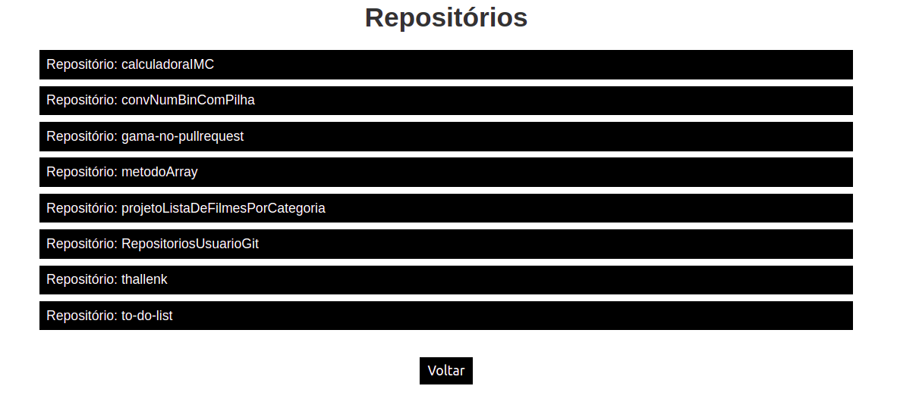
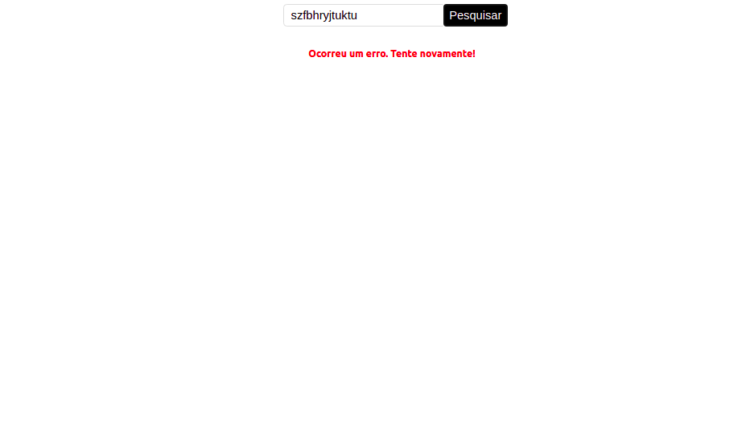

# Buscando repositórios de um usuário do github com ReactJS

A pagina inicial possui um campo paga o usuário e um botão:

Ao inicial com um usuário válido, a página é redirecionada para /repositories com os repositórios listados do usuário inserido.

Caso seja inserido um usuário invalido. A seguinte mensagem é mostrado:

Esse projeto consiste na busca dos nomes dos repositórios de um usuário do github através do API do github utilizando o axios para a requisição.

É utilizado ferramentas do ReactJS como Hoots com useState e useEffect para tratamento dos dados, rotas com react rout dom para uma aplicação SPA (Simple Page Application), Local Storage, dentre outras...

Conceitos abordados de ReactJS:

- Hoots (com useState e useEffect para tratamento dos dados)
-Componentes
- Propriedades
- Estado
- Rotas (com react rout dom para uma aplicação SPA (Simple Page Application))
- Eventos
- Estilização (utilizando styled-componets)
- Lidar com erros e experiências do usuário a partir de redenrização condicional.
- Para simular uma arquivo HTML é utilizado o JSX.

Para iniciar a aplicação, basta chamar "npm start" no terminal dentro da pasta.